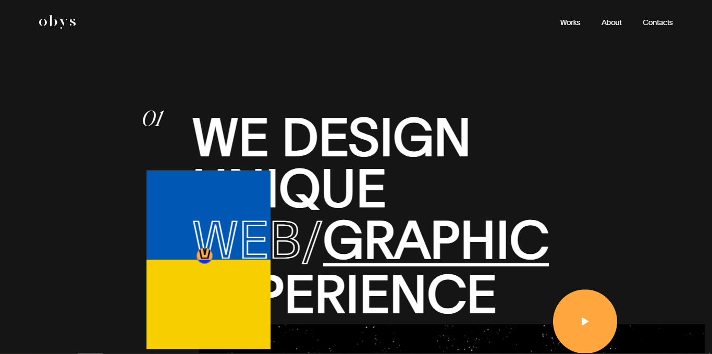

<h1 id="obys-agency-website-clone">Obys Agency Website Clone</h1>

This project is a clone of the Obys Agency website, implemented using HTML, CSS, JavaScript, GSAP, Locomotive Scroll, and Shery.js.

<h2 id="table-of-contents">Table of Contents</h2>
<ul>
<li><a href="#overview">Overview</a></li>
<li><a href="#demo">Demo</a></li>
<li><a href="#features">Features</a></li>
<li><a href="#prerequisites">Prerequisites</a></li>
<li><a href="#installation">Installation</a></li>
<li><a href="#contributing">Contributing</a></li>
<li><a href="#license">License</a></li>
</ul>
<h2 id="overview">Overview</h2>

Describe briefly what the project is about and its purpose. Include any relevant information about the technologies used and the goals of the clone.

<h2 id="demo">Demo</h2>

Explore the live demo of the Obys Agency Clone Website: <a href="https://antra77.github.io/Obys-Agency-Clone/">Live Demo</a>

<h2 id="features">Features</h2>

List the key features of the website clone. This could include interactive animations, responsive design, smooth scrolling, etc.

<h2 id="prerequisites">Prerequisites</h2>

Outline any software or dependencies that need to be installed before running the project. For example:

<ul>
<li>Node.js</li>
<li>npm</li>
</ul>
<h2 id="installation">Installation</h2>
<ol>
<li>Clone the repository:
git clone <a href="https://github.com/your-username/obys-agency-clone.git">https://github.com/your-username/obys-agency-clone.git</a>	</li>
<li>Change into the project directory:
cd obys-agency-clone
3.Install dependencies:
npm install</li>
</ol>
<h2 id="contributing">Contributing</h2>

If you&#39;d like to contribute to this project, please follow the contribution guidelines.

<h2 id="license">License</h2>

This project is licensed under the MIT License.

